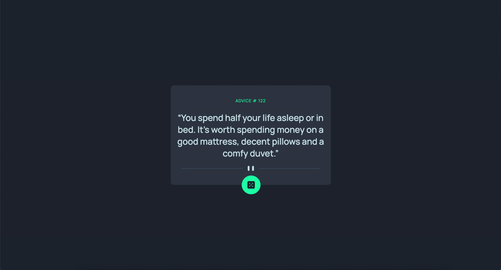

# Frontend Mentor - Advice generator app solution

This is a solution to the [Advice generator app challenge on Frontend Mentor](https://www.frontendmentor.io/challenges/advice-generator-app-QdUG-13db). Frontend Mentor challenges help you improve your coding skills by building realistic projects.

## Table of contents

- [Overview](#overview)
  - [The challenge](#the-challenge)
  - [Screenshot](#screenshot)
  - [Links](#links)
- [My process](#my-process)
  - [Built with](#built-with)
  - [Continued development](#continued-development)
  - [Useful resources](#useful-resources)
- [Author](#author)
- [Acknowledgments](#acknowledgments)

## Overview

Thank you for reviewing my code. I chose this Frontend Mentor challenge so I could practice working with API's. I look forward to taking on more difficult challenges where I can practice these skills.

### The challenge

Users should be able to:

- View the optimal layout for the app depending on their device's screen size
- See hover states for all interactive elements on the page
- Generate a new piece of advice by clicking the dice icon

### Screenshot

### Links

- Solution URL: https://github.com/timbosTours/Frontend-Mentor-advice-generator-app
- Live Site URL: https://timbostours.github.io/Frontend-Mentor-advice-generator-app/

## My process

I started with building out the javascript functionality. Then once I had the advice data successfully appending to the HTML I went ahead and designed the HTML layout then finished with the CSS styling.

### Built with

- Semantic HTML5 markup
- CSS custom properties
- Mobile-first workflow

### Continued development

I still have a few things to work on when it comes to fully understanding the way data is passed around between different servers/browsers. Always working on improving my understanding of accessibillity.

### Useful resources

I used this video to learn document.fragment().

- https://www.youtube.com/watch?v=aUzCq-uabhw

## Author

- Website - [Timothy Fawcett](https://github.com/timbosTours)
- Frontend Mentor - [@timbosTours](https://www.frontendmentor.io/profile/timbosTours)
- Twitter - [@timbosTours](https://www.twitter.com/timbosTours)

## Acknowledgments

Big thanks to anyone who takes the time to review my code. 

Shout out to Dom from dcode.
-https://www.youtube.com/c/dcode-software

And Rob Dodson
-https://www.youtube.com/watch?v=HtTyRajRuyY&list=PLNYkxOF6rcICWx0C9LVWWVqvHlYJyqw7g